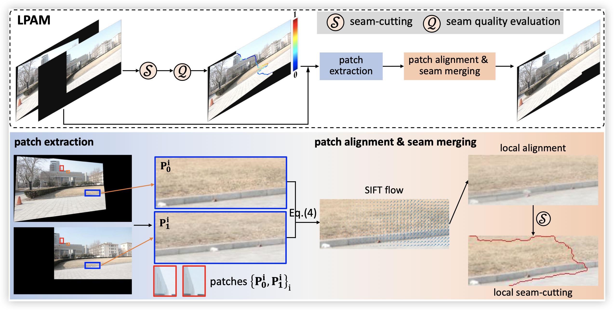

## Leveraging Local Patch Alignment to Seam Cutting for Large Parallax Image Stitching

<p align=center>Tianli Liao<sup>1</sup>, Chenyang Zhao<sup>1</sup>, Lei Li<sup>1</sup>, Heling Cao<sup>1</sup>

<p align=center><sup>1</sup>Henan University of Technology</p>

<br>



### Usage

---

Download the code, add images in the folder "Imgs" in the main path, and run the "main.m".

### Citation

```
@InProceedings{Liao_2025_ICCV,
    author    = {Liao, Tianli and Zhao, Chenyang and Li, Lei and Cao, Heling},
    title     = {Leveraging Local Patch Alignment to Seam-cutting for Large Parallax Image Stitching},
    booktitle = {Proceedings of the IEEE/CVF International Conference on Computer Vision (ICCV)},
    month     = {October},
    year      = {2025},
    pages     = {27262-27271}
}
```

If you have any comments, suggestions, or questions, please contact me (tianli.liao@haut.edu.cn).
